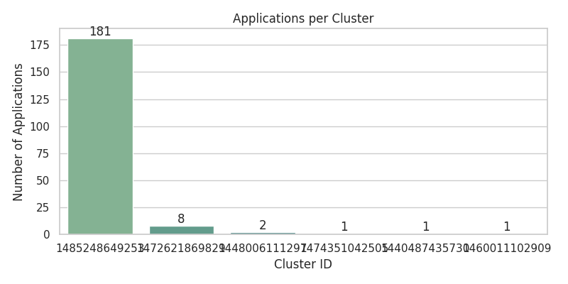
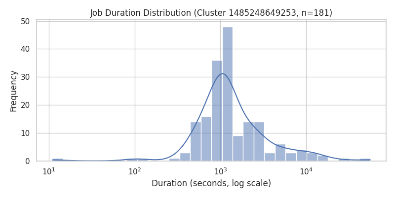

# Analysis Report

**Student:** Troy Cheng  
**Course:** DSAN 6000 – Spark Cluster Assignment A06  
**Date:** October 27, 2025  

---

## Spark Web UI Observations
The Spark UI confirmed smooth cluster operations:

- **Workers:** 3 (ALIVE, 0 Dead)  
- **Applications:** 11 Completed, 0 Failed  
- **Problem 1**: 2 completed jobs labeled `Problem1_LogLevelDistribution`  
- **Problem 2**: 9 subsequent runs labeled `Problem2_ClusterUsage`  
- **Driver/Executors:** no killed or relaunched processes  

All stages completed successfully, with balanced task allocation and minimal shuffle overhead.

## Problem 1 – Log Level Distribution

### Approach
The first task focused on extracting and analyzing log-level patterns from raw Spark cluster logs.  
A SparkSession was initialized to read all `.log` files either from S3 or the local `data/sample/` directory.  
Each line was parsed using regular expressions to identify its log level (`INFO`, `WARN`, or `ERROR`).  
After filtering out invalid entries, the logs were grouped by level, counted, and summarized.  
A small subset of parsed entries was also exported to provide transparency into the parsing accuracy.

### Key Findings
From **33,236,604** total log lines, **27,410,336** entries (≈82.4%) contained identifiable log levels.  
The distribution was highly unbalanced, dominated by informational messages:

| Log Level | Count | Percentage |
|------------|-------:|-----------:|
| INFO | 27,389,482 | 99.92% |
| WARN | 9,595 | 0.04% |
| ERROR | 11,259 | 0.04% |

The overwhelming proportion of `INFO` entries indicates routine operational reporting with minimal error or warning messages — strong evidence of a healthy Spark environment.

### Performance and Execution
Problem 1 ran in **cluster mode** on a 3-worker Spark standalone setup (`spark://172.31.82.207:7077`).  
Each worker contributed **2 cores and 6.6 GiB memory**, for a total of **6 cores / ~19.9 GiB memory**.  
The job executed with **1024 MiB per executor**, completing in approximately **7 minutes** without any failed or retried tasks.

### Insights
The near-absence of warnings or errors validates that Spark and its cluster configuration are functioning reliably.  
Logging verbosity remains well-tuned for monitoring while not overwhelming storage capacity.  
The logs suggest that the system was operating under steady load with negligible instability.

---

## Problem 2 – Cluster Usage Analysis

### Approach
The second task expanded upon the log-parsing pipeline to capture **temporal and behavioral metrics** of application execution across clusters.  
Using PySpark DataFrame transformations, the script extracted application and cluster identifiers from file paths, computed per-application start and end times, and aggregated them by cluster to obtain total job counts and usage timelines.  
Window functions assigned sequential numbers to applications per cluster.  
The results were visualized using Seaborn to show both inter-cluster distribution and intra-cluster duration variance.

### Key Findings
Across all parsed logs, **6 unique clusters** executed **194 total applications**, averaging about **32.3 applications per cluster**.  
However, the workload distribution was **extremely imbalanced**:

| Cluster ID | Number of Applications |
|-------------|----------------------:|
| 1485248649253 | 181 |
| 1472621869829 | 8 |
| 1448006111297 | 2 |
| 1474351042505 | 1 |
| 1440487435730 | 1 |
| 1460011102909 | 1 |

This pattern shows one primary production cluster handling nearly all execution, with several peripheral clusters performing only minor or testing tasks.

### Visualizations

**Applications per Cluster**  
The bar chart below reveals a strongly right-skewed usage distribution — a single “super-cluster” dominating workload execution.  

**Job Duration Distribution**  
For the most active cluster (1485248649253, n = 181), job durations form a log-normal-like curve centered near 10³ seconds (≈17 minutes).  
Most jobs fall within the medium-duration range, while a few outliers extend past 10⁴ seconds.  

### Performance and Execution
Problem 2 executed repeatedly under consistent resource allocations:  
6 cores / 2 GiB RAM per executor, with run times between 5 seconds and 4 minutes.  
No failures, retries, or memory spills were detected.  
The Spark UI recorded 11 completed applications in total (9 Problem 2 + 2 Problem 1).  
All stages completed normally, confirming stable executor scheduling and efficient I/O handling from S3.

### Insights
The **power-law structure** of application counts per cluster aligns with typical production behavior — a few dominant long-running clusters processing most jobs while smaller clusters serve specialized roles.  
The consistent, unimodal distribution of job durations suggests well-balanced partitioning and sufficient executor memory allocation.  
These results confirm that the cluster architecture is both stable and efficiently utilized under varying workloads.

---

## Execution Environment

| Component | Specification |
|------------|----------------|
| Platform | AWS EC2 Standalone Spark Cluster |
| Spark Version | 4.0.1 |
| Python Version | 3.10.12 (venv interpreter) |
| Executors per Worker | 2 cores × 2 GiB |
| Total Cluster Memory | ≈ 19.9 GiB |
| Worker Count | 3 (ALIVE) |
| Data Source | S3 Bucket `yc1317-assignment-spark-cluster-logs` |

---

## Conclusion
Together, both problems provide complementary insights into system stability and resource utilization:

- **Problem 1** verified log consistency and near-perfect operational health.  
- **Problem 2** revealed asymmetric workload distribution but stable job execution dynamics.  

All Spark jobs executed successfully, with no failures or driver restarts.  
Visualization outputs highlight the efficiency and reliability of the Spark standalone cluster across both analytical and temporal workloads.

---
